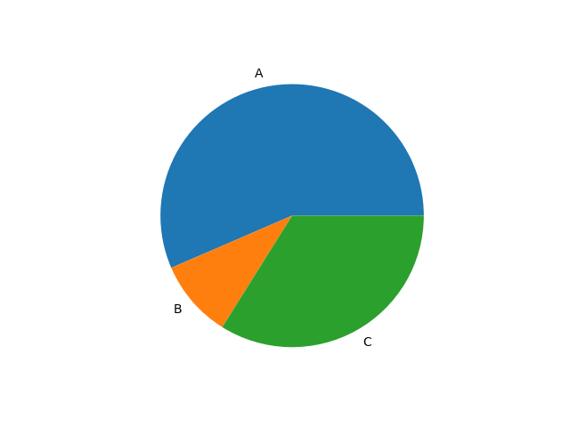

# Github y python

Repositorio del curso Python con Git y GitHub en Platzi

## Juego piedra papel o tijera

Dentro de la carpeta game, esta incluido el juego de piedra, papel o tijera. Las instrucciones para correrlo desde terminal son las siguientes

```sh
cd game
python3 main.py
```

-----------------

## Programa para generar graticas

Dentro de la carpeta charts se ha creado un programa el cual nos crea una gráfica, para ustar este programa



para usar el programa, las instrucciones son:

```sh
cd charts
python3 main.py
```

-----------------

Ahora mismo usamos el markdown, para ver que tal sale
>El que tenga miedo de morir que no nazca
*letras en cursiva*
**Letras en negrita**

## Lista

Ahora vamos a crear una lista donde se van a ir viendo cosas

- hola
- hola 2
- hola mundo
  - segundo nivel del hola
  - hello
  - hi
- regresamos de nivel
- genial

`print('hello world)`

$$ a^2 + b^2 = c^2 $$ (1)
